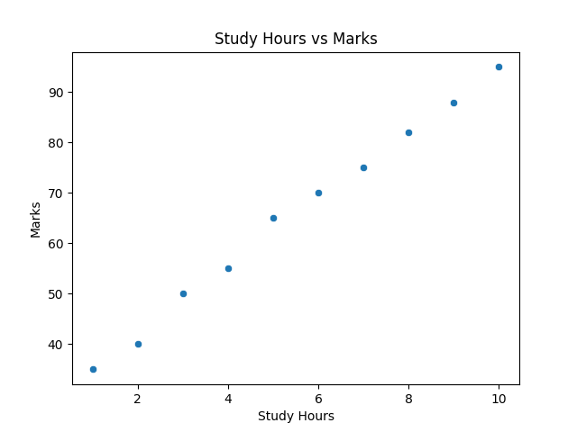
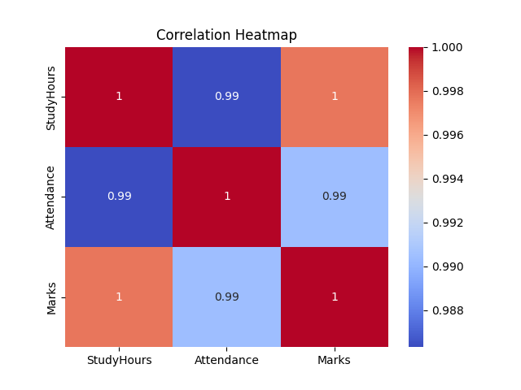

# Exploratory Data Analysis (EDA) Project

## 📌 Objective
Analyze student performance data to identify patterns and relationships.

## 🔧 Tools Used
- Python
- Pandas
- Matplotlib
- Seaborn

## 📊 Analysis Performed
- Statistical summary
- Correlation analysis
- Data visualization

## 📈 Key Insights
- Higher study hours lead to higher marks
- Attendance positively affects marks

## 📷 Output

### Study Hours vs Marks

### Correlation Heatmap

## 🚀 Run
pip install pandas matplotlib seaborn  
python eda.py